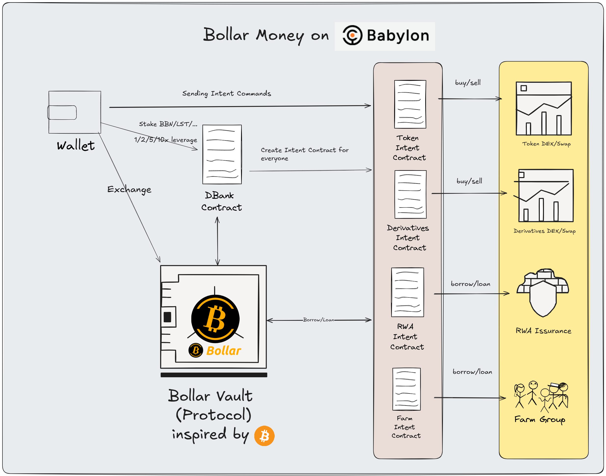

## Bollar Money

### What's `Bollar`  

`Bollar` - Bitcoin dollar, inspired by `bitcoin`, follows bitcoin's money theory and combines the PoS chain's revenue model, deployed on the `Babylon` chain. `Bollar` is a stablecoin, Bollar is issued by the `Bollar protocol`.

`Bollar protocol` - 1 `Bollor` = 1 `USD`, the total issuance of Bollar is determined by the number and price of staked `btc`, `Bollar protocol` will issue 50% of the total staked `btc` when it is launched, and `Bollar` will be held by `Bollar vault` when it is issued. Whenever `btc` rises by 10,000U, `BollarDAO` will issue a proposal to issue additional `Bollar`.

`Bollar vault` - `Bollar Vault` is a natural liquidity pool, and also the ledger and interface of `Bollar`. `Bollar` vault provides two ways for `Bollar` to enter the market: 1. Excess 120% mortgage lending, 2. 1:1 exchange with `USD`, the process of user mortgage or exchange is also the process of unlocking `Bollar` liking `Bitcoin miner`, and ensures the stability of Bollar's value.

### Vision
Bitcoin is a peer-to-peer electronic cash system that aims to build a decentralized financial system to provide individuals with digital identity and digital currency sovereignty and ledgers, for a detailed introduction to Bitcoin, please refer to the [Bitcoin white paper](https://bitcoin.org/bitcoin.pdf).

First of all, `bitcoin` is positioned as a `Money`. It was electronic cash at the beginning and now it is digital gold. Holding `bitcoin` has become the happiest and most joyful way to get rich in life.

As the value of `bitcoin` continues to rise, the handling fees of the Bitcoin network are also increasing, and the Bitcoin network is becoming more and more crowded. Although the value of `bitcoin` has exceeded 1 trillion, most of the `bitcoin` assets are idle.

The vision of `Bollar` is to serve as derivative currency of `bitcoin` to solve the problem of insufficient liquidity of Bitcoin and realize the connection between `bitcoin` and the real world

### Architecture

### Benefits
- Bollar is a stablecoin protocol on `Babylon`, inspired by the staked `bitcoin` on `Babylon`
- Bollar releases the liquidity (btc as Money) of staked `btc` for the Babylon ecosystem, about $1 billion
- Bollar brings benefits to `Babylon's` bitcoin stakers, similar to Consume chain, BTC stakers get interest through Bollar protocol, attracting more BTC holders to stake BTC
- Bollar brings benefits to `Babylon` tokens
- Bollar consumes `Babylon` tokens as gas
- Stablecoin as a service, providing financial services such as lending and payment for the BSN (Bitcoin Secured Network) ecosystem, helping Babylon becomes not only the blockchain security core, but also the liquidity center

### Issuance method
Issue 50% of the value of `Bollar` based on the amount of `btc staking` on the `Babylon chain`. 

For example, when BTC/USD is $70,000, if `Babylon` chain has staked 20,000 `btc` now, `Bollar protocol` will issue 20,000 * 35,000 `Bollars`.
If the price of `btc` rises to $80,000, it is possible to re-issue 20,000 * 10,000 / 2 through DAO governance

### Governance
`Bollar protocol` is governed by `BollarDAO`

### Setup
- compile `cargo wasm`
- test `cargo unit-test`

## License

This is licensed under the MIT license. Do what you want with it.
